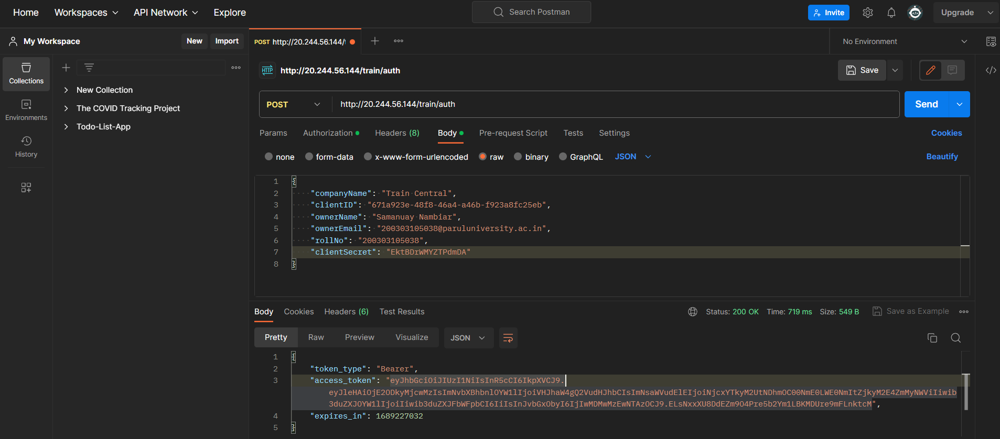
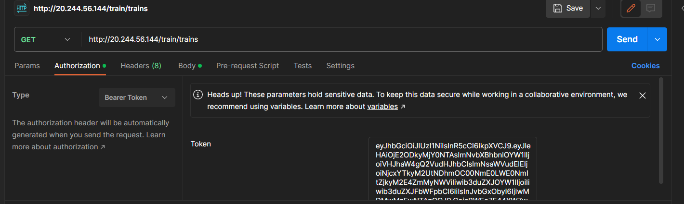
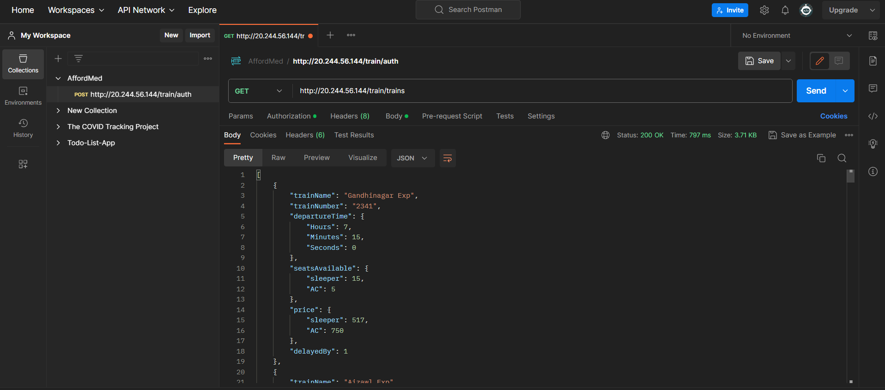
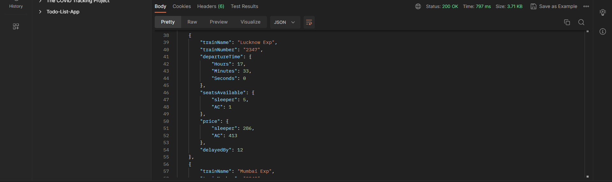
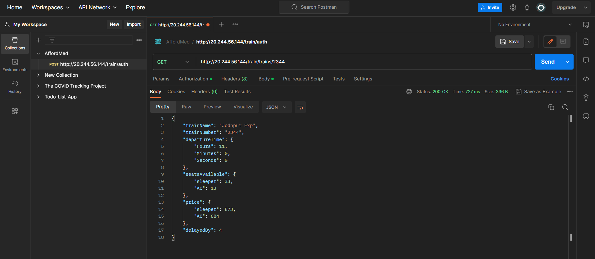

// Registered my company with john doe railway server...

// Generated Authorization token for page access...

// Set token as Bearer token & called trains api url as GET method

// Get method for listing specific train based on train number...

